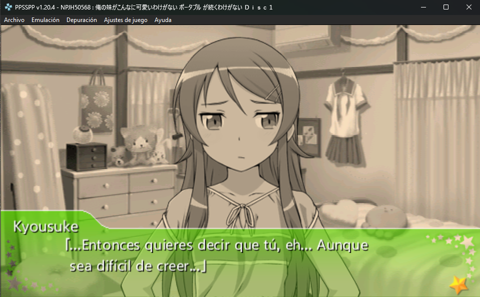
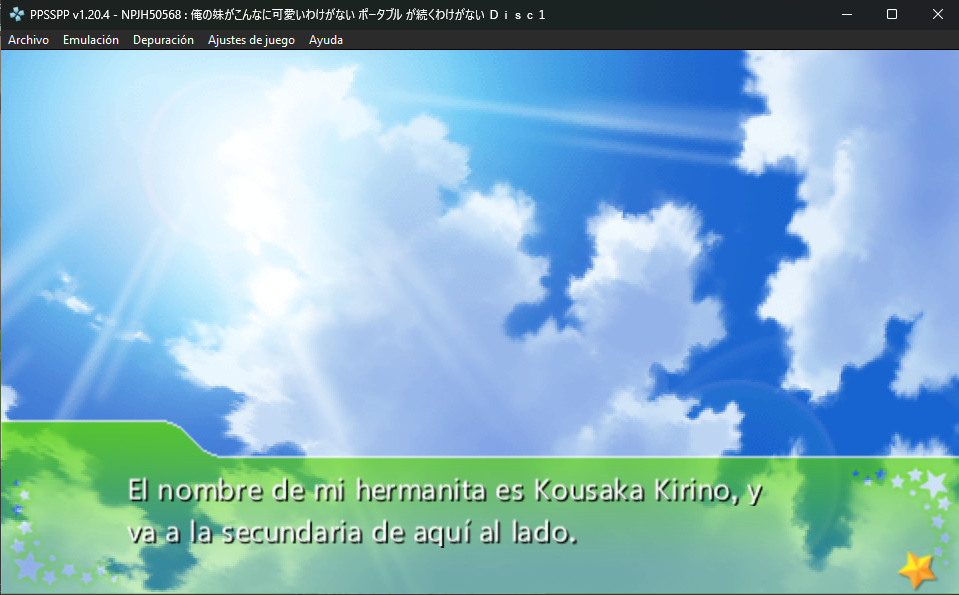

# Oreimo Portable — Traducción al Español (ES)

[](translation/Translation.json)
[]()
[](LICENSE)

Traducción **no oficial** al español latinoamericano de la novela visual PSP **_Oreimo Portable ga Tsuzuku Wake ga Nai_** (Discos 1 y 2), partiendo de la versión en inglés v1.

> Este repositorio registra el **progreso de traducción**, el **corpus extraído** y los **scripts de automatización** del proyecto. Las ISOs finales no se distribuyen aquí.

---

## Estado del proyecto

| Disco | Progreso |
|---|---|
| **Disco 1** (historia) | 554 / 18.805 líneas — **2.95%** |
| Disco 2 (historia) | pendiente |
| envpsp.dat (texto del sistema) | pendiente |

Los **nombres** de personajes (38) ya están traducidos y aplicados en todas las escenas.


## Estructura del repositorio

```
├── translation/
│   ├── Translation.json      # Progreso de traducción (fichero principal)
│   ├── corpus/               # Texto EN extraído de las escenas (299 .tsv + names.txt)
│   └── review/               # Hojas XLSX de revisión (EN → ES)
├── scripts/                  # Scripts de traducción por lotes
├── tool/OreimoAutomation/    # Driver de automatización (C#)
└── tool-bin/                 # Utilidades para el repaqueado de la ISO
```

### ¿Cómo funciona el flujo?

1. **Extracción**: la ISO EN v1 se desempaca en escenas (`.obj`) y se vuelca el corpus.
2. **Traducción**: las escenas se traducen por lotes (10 escenas por lote).
3. **Revisión**: cada lote se exporta a XLSX (`EN | ES`) para su revisión.
4. **Rempacado**: las traducciones se inyectan, se reinsertan los saltos de línea automáticos y se reconstruye la ISO con la fuente latina (soporta acentos).

> Los `Translation.json` y el corpus contienen únicamente **texto**, nunca assets ni código del juego.

## Demo





<video src="https://github.com/christ-gm/oreimo-es/raw/main/assets/gameplay.mp4" controls width="640"></video>

## Herramientas usadas

- [FastAsyncOreimoTranslateTool](https://github.com/zapan/FastAsyncOreimoTranslateTool) — toolchain base de extracción/reempacado.
- `OreimoAutomation` — driver propio que automatiza todo el pipeline de forma headless.
- `.NET 10`, Python, `mkisofs`.

## Licencia

El trabajo de **traducción y los scripts propios** de este repositorio están bajo **CC BY-NC-SA 4.0**.

El contenido del juego (código, imágenes, audio y texto original) pertenece a sus respectivos titulares de derechos (**Aniplex / ASCII Media Works**). Este proyecto es una traducción de fans, sin fines comerciales, y no está afiliado ni respaldado por los titulares de derechos.

Para jugar necesitas una **copia legal** del juego. Este repositorio no incluye las ISOs.