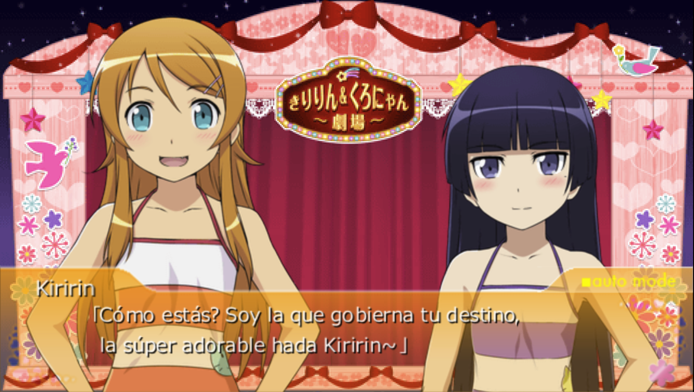
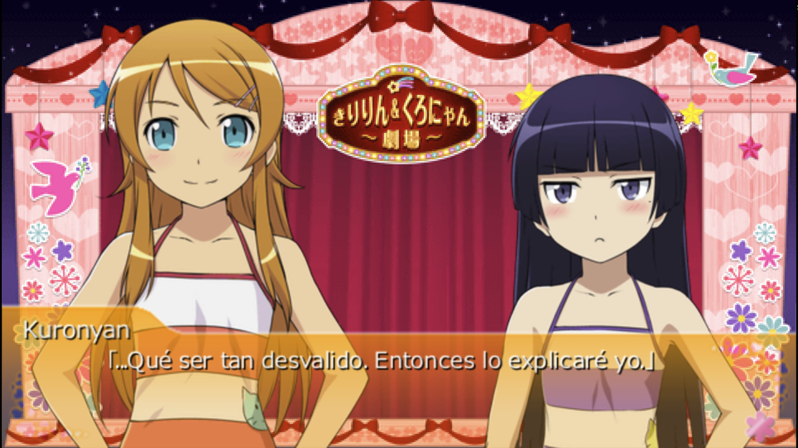

# Oreimo Portable — Traducción al Español (ES)

[](translation/Translation.json)
[](translation/Translation_disc2.json)
[]()
[](LICENSE)

Traducción **no oficial** al español latinoamericano de la novela visual PSP **_Oreimo Portable ga Tsuzuku Wake ga Nai_** (Discos 1 y 2), partiendo de la versión en inglés v1.

> Este repositorio registra el **progreso de traducción**, el **corpus extraído** y los **scripts de automatización** del proyecto. Las ISOs finales no se distribuyen aquí.

---

## Estado del proyecto

| Disco | Progreso |
|---|---|
| **Disco 1** (historia) | 18.805 / 18.805 líneas — **100%** (299 escenas) (faltan las desiciones)|
| **Disco 2** (historia) | 18.949 / 18.949 líneas — **100%** (268 escenas) |
| envpsp.dat (texto del sistema) | pendiente |

Los **nombres** de personajes ya están traducidos y aplicados en ambos discos (38 en el disco 1, 75 en el disco 2).

Todos los diálogos fueron re-ajustados con la métrica real del juego: cada línea cabe en la caja de diálogo (~570 px medidos glifo a glifo con el fontmap), así que ya no hay texto cortado.

---

## Aviso importante (traducción MTL)

Esta traducción es **MTL (Machine Translation)**: fue generada con traducción automática y revisada manualmente en lo posible, **no** es una traducción humana profesional. Puede haber frases poco naturales, errores de contexto o detalles que no te gusten.

Quiero ser transparente desde el principio para que no te lleves sorpresas: simplemente quería una opción para jugar este juego en español y no me gustaban las alternativas que existían, así que me dediqué a crear la mía propia y compartirla para quien quiera usarla.

## Demo

### Disco 1


https://github.com/user-attachments/assets/89a1ea8c-f36d-41dd-9895-dd198a5309c8

### Disco 2





## Créditos

- **[dizzyziddy — Oreimo Tsuzuku PSP Disc 1 Full English Patch](https://dizzyziddy.xyz/2015/02/14/oreimo-tsuzuku-psp-disc-1-full-english-patch-release/)** — este proyecto se construyó **sobre su parche en inglés v1**, que sirvió como base del texto. ¡Muchas gracias por ese trabajo!

---

## Cómo parchar tu ISO

Este repositorio **no incluye ISOs ni el código de la toolchain original** (ver [Herramientas usadas](#herramientas-usadas)). Incluye dos asistentes que hacen todo por ti: **`build_iso.bat`** (Windows) y **`build_iso.sh`** (Linux/WSL).

> El único requisito de entrada es tu **ISO con el parche EN v1 de dizzyziddy ya aplicado** (link en [Créditos](#créditos)).
> Funciona con **cualquiera de los dos discos**: el asistente detecta automáticamente cuál es por el serial UMD (`NPJH-50568` = Disco 1, `NPJH-50569` = Disco 2) y aplica la traducción correspondiente.

### Windows (fácil) — `build_iso.bat`

1. Descarga este repositorio como **ZIP** (botón verde *Code* → *Download ZIP*) y descomprímelo.
2. Coloca tu ISO (ya con el parche EN aplicado) donde quieras, por ejemplo en la misma carpeta.
3. **Arrastra el archivo `.iso` sobre `build_iso.bat`** y suéltalo. (También puedes abrir `build_iso.bat` y escribir la ruta.)
4. Si te falta el .NET SDK, el propio asistente lo instalará automáticamente o te dará el enlace.
5. Al terminar tendrás tu ISO en español con el sufijo `_ES` y se abrirá la carpeta donde se guardó.

> La primera vez descarga la toolchain base de zapan (necesita internet); las siguientes reutilizan la copia local.
> Windows puede mostrar "Editor desconocido" al ejecutar el `.bat` (no está firmado): pulsa *Más información → Ejecutar de todas formas*.

### Linux / WSL — `build_iso.sh`

#### Prerrequisitos

1. Una **copia legal** \*guiño guiño\* del juego (ISO de PSP de *Oreimo Portable ga Tsuzuku Wake ga Nai*) Recomendablemente la de **[dizzyziddy — Oreimo Tsuzuku PSP Disc 1 Full English Patch](https://dizzyziddy.xyz/2015/02/14/oreimo-tsuzuku-psp-disc-1-full-english-patch-release/)**.
2. **.NET SDK** (10 o superior), **git** y **mkisofs** (de cdrtools) en tu `PATH`.
3. Linux / WSL (Windows Subsystem for Linux).

#### Pasos

```bash
git clone https://github.com/christ-gm/oreimo-es.git
cd oreimo-es
./build_iso.sh /ruta/a/tu.iso          # genera /ruta/a/tu.iso con el sufijo _ES
```

Opciones del script:

- `--out <archivo.iso>`: nombre de la ISO resultante (por defecto: `<tu_iso>_ES.iso`).
- Variables de entorno `TOOLCHAIN_DIR` y `WORK_DIR` para reutilizar un clon existente de la toolchain y elegir el directorio de trabajo.

#### Pasos manuales (equivalente al script)

```bash
git clone https://github.com/christ-gm/oreimo-es.git
git clone https://github.com/zapan/FastAsyncOreimoTranslateTool.git

# Compila el driver (resuelve las librerías de la toolchain automáticamente)
cp -r oreimo-es/tool/OreimoAutomation FastAsyncOreimoTranslateTool/
cd FastAsyncOreimoTranslateTool
dotnet build OreimoAutomation -c Release

mkdir -p work
export DLL=$(pwd)/OreimoAutomation/bin/Release/net10.0/OreimoAutomation.dll
export BASE=$(pwd)/work

dotnet "$DLL" extract-iso /ruta/a/tu.iso --base "$BASE"        # 1) Extrae tu ISO
dotnet "$DLL" extract-game --base "$BASE"                      # 2) Extrae los datos del juego
# Disco 1:
cp ../oreimo-es/translation/Translation.json "$BASE"/Data/Translation.json
# Disco 2:
cp ../oreimo-es/translation/Translation_disc2.json "$BASE"/Data/Translation.json
dotnet "$DLL" insert-linebreaks 0 570 --base "$BASE"           # 3) Aplica la traducción (ancho de caja: 570px)
dotnet "$DLL" repack-game --base "$BASE"                       # 4) Reempaqueta los datos
dotnet "$DLL" repack-iso "$BASE"/oreimo_es.iso --base "$BASE"  # 5) Reempaqueta la ISO
```

> **mkisofs**: si no lo tienes, en Debian/Ubuntu puedes instalarlo con `sudo apt install genisoimage` (o `cdrtools` en Arch). Asegúrate de que esté en tu `PATH`.

---

## Correcciones y reportes

¿Encontraste un error de traducción, una frase mal contextualizada o un detalle en los subtítulos? **Eres libre de abrir un [issue](https://github.com/christ-gm/oreimo-es/issues)** con la escena, el texto original y tu sugerencia de corrección.

Los iré revisando **a mi ritmo** (después de todo esto es un proyecto personal pipipi ;-;). Además, conforme vaya jugando e identifique detalles, los iré corrigiendo yo mismo en futuras actualizaciones.

---

## Oreimo Translator — app de escritorio

Además de los asistentes de arriba, este repositorio incluye en [`gui-interface/`](gui-interface/) una **aplicación de escritorio** (Windows y macOS) para editar el guion del juego sin tocar un editor hexadecimal ni la línea de comandos:

- Abre tu ISO e indexa las ~19.000 líneas de diálogo de las 300 escenas.
- Busca, filtra y edita las traducciones línea por línea.
- Exporta e importa CSV/TSV, para traducir en Excel o Google Sheets y repartir el trabajo.
- Ve, exporta e importa las imágenes de cada escena (fondos, CG, personajes, cutins).
- Compila una ISO jugable con tus cambios, sin modificar la original.

Está pensada para que **cualquiera pueda hacer su propia traducción del juego, a cualquier idioma** — no solo esta al español. Se descarga ya compilada desde [Releases](../../releases), sin necesidad de instalar Python.

📖 **Documentación completa de la app: [`gui-interface/README.md`](gui-interface/README.md)** (está en inglés) — instalación, uso, alcance actual y detalles técnicos del formato.

---

## Estructura del repositorio

```
├── translation/
│   ├── Translation.json        # Disco 1: traducción consolidada (fichero principal)
│   ├── Translation_disc2.json  # Disco 2: traducción consolidada (fichero principal)
│   ├── corpus/                 # Texto EN extraído del disco 1 (299 .tsv + names.txt)
│   ├── corpus_disc2/           # Texto EN extraído del disco 2 (268 .tsv)
│   ├── disc2_batches/          # Lotes de traducción del disco 2 (batch_00..19.json)
│   └── review/                 # Hojas XLSX de revisión (EN → ES)
├── gui-interface/              # Oreimo Translator: app de escritorio (ver su propio README)
├── retorts/                    # Imágenes de "retorts" (mensajes rápidos) traducidas
├── scripts/                    # Scripts de traducción por lotes y del pipeline
├── tool/OreimoAutomation/      # Driver de automatización (C#, propio)
├── tool-bin/                   # Utilidades para el repaqueado de la ISO (mkisofs)
├── toolchain-patches/          # Parches propios para la toolchain de zapan
├── build_iso.bat               # Asistente para Windows (arrastra tu ISO)
└── build_iso.sh                # Asistente para Linux / WSL
```

### ¿Cómo funciona el flujo?

1. **Extracción**: la ISO EN v1 se desempaca en escenas (`.obj`) y se vuelca el corpus.
2. **Traducción**: las escenas se traducen por lotes (10 escenas por lote).
3. **Revisión**: cada lote se valida automáticamente (paridad de saltos de línea, strings vacíos) y se exporta para su revisión.
4. **Rempacado**: las traducciones se inyectan, se reinsertan los saltos de línea validados contra el ancho real de la caja de diálogo (~570 px, medido glifo a glifo con el fontmap del juego) y se reconstruye la ISO con la fuente latina (soporta acentos).

> Los `Translation.json` y el corpus contienen únicamente **texto**, nunca assets ni código del juego.

## Herramientas usadas

- [FastAsyncOreimoTranslateTool](https://github.com/zapan/FastAsyncOreimoTranslateTool) — toolchain base de extracción/reempacado (de [IchinichiQ](https://github.com/IchinichiQ/ToradoraTranslateTool) y [computer-catt](https://github.com/computer-catt/FastAsyncToradoraTranslateTool)).
- `OreimoAutomation` — driver propio que automatiza todo el pipeline de forma headless.
- `.NET 10`, Python, `mkisofs`.

## Licencia

El trabajo de **traducción y los scripts propios** de este repositorio están bajo **CC BY-NC-SA 4.0**.

El contenido del juego (código, imágenes, audio y texto original) pertenece a sus respectivos titulares de derechos (**Aniplex / ASCII Media Works**). Este proyecto es una traducción porque me dio la gana, sin fines comerciales, y no está afiliado ni respaldado por los titulares de derechos.

Para jugar necesitas una **copia legal** \*guiño guiño\* del juego. Este repositorio no incluye las ISOs.
