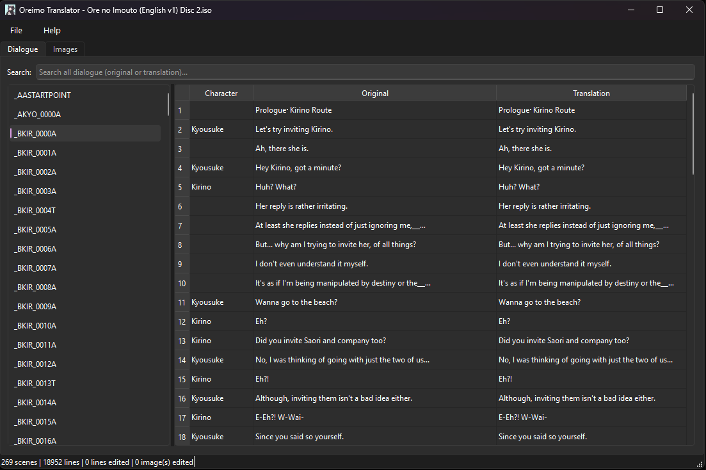
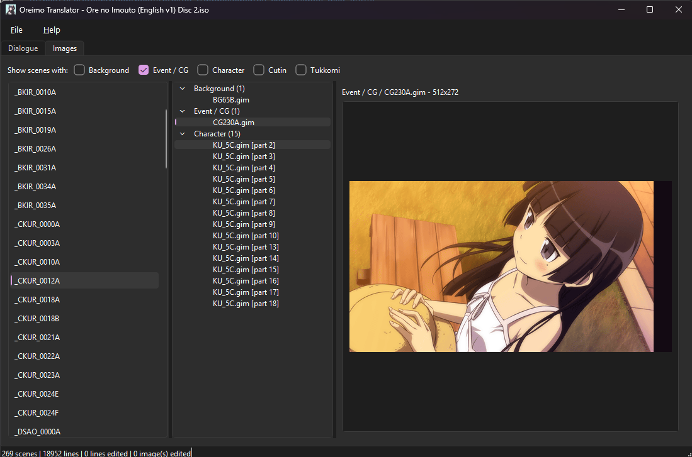
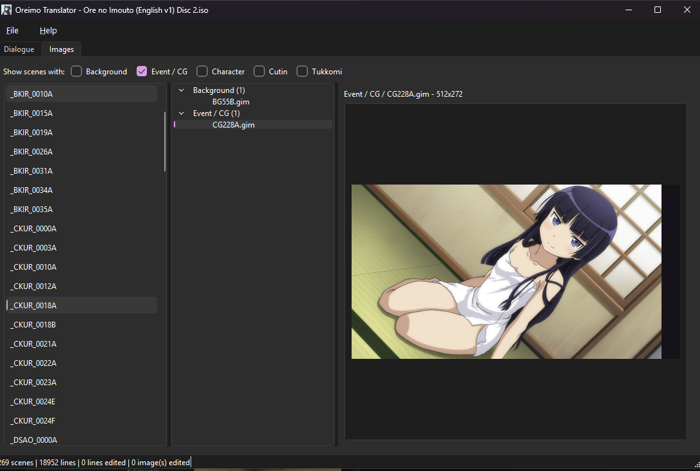

# Oreimo Translator

A desktop GUI (PySide6) for translating the script of *Ore no Imouto ga
Konna ni Kawaii Wake ga Nai Portable* (PSP) — built so anyone can produce
their own fan translation of the game, in any language, without touching
a hex editor.

It is the "productized" form of the reverse-engineering work carried out
in the sibling research project (the parent folder of this repo): the
`GPDA` container format, the `.obj` script bytecode with its `blockLen`
block structure, and the binary ISO-patching approach are all proven
against the real game. This app vendors that same logic into a
self-contained Python package (`src/oreimo_translator/core/`), so it runs
on its own — no need to clone the research project or run any other
tooling first.

> Technical references below point at `documentation/FORMAT_NOTES.md`,
> which lives in that **sibling research project**, not in this repo. It
> is the format reference: how each structure was decoded, and how every
> bug listed here was tracked down.

## Screenshots

<!-- Drop the PNGs into docs/screenshots/ with these names and delete the
     comment markers around each block. Any name works - just keep the
     path and the caption in sync. -->

### Dialogue view



### Images view





## How it works

The game stores its ~19,000 dialogue lines inside `RES.DAT`, a nested
archive format with strings encoded as UTF-16LE inside self-describing
binary blocks. The app automates the full round trip:

```
ISO  →  extract RES.DAT  →  decompress every scene  →  parse blocks
  →  edit strings in memory  →  rebuild blocks + archives
  →  patch a copy of the ISO  →  playable, translated ISO
```

1. **Open ISO** — reads `RES.DAT` directly out of the raw ISO file (no
   mounting, no OS-specific tools) and indexes every translatable line
   across all ~300 scenes in a few seconds.
2. **Browse & search** — scenes are listed on the left; the table on the
   right shows character, original text, and translation side by side.
   The search box filters across every scene at once, matching either
   original or translated text.
3. **Translate** — double-click a translation cell and type. Edits are
   held in memory only; the source ISO is never touched until you choose
   to compile.
4. **Export / Import** — send the whole project, a single scene, or every
   scene as separate files to CSV/TSV, so translation can happen in
   Excel, Google Sheets, or handed off to other people, then re-imported.
   Each row carries stable IDs (scene + block position), so re-importing
   safely matches edits back to the right line even after re-opening the
   ISO later. Full format spec below.
5. **Compile ISO** — rebuilds only the scenes that were actually edited,
   re-nests every archive level, and binary-patches the result into a
   fresh copy of the ISO (the original file is never modified). Typically
   finishes in well under a second for dialogue-only edits.
6. **View, export and import scene images** — the "Images" tab shows
   every background, event/CG, character and cutin/tukkomi texture
   (`MIG.00.1PSP`/`.gim`, PSP's proprietary format) attached to the
   selected scene, decoded on demand, and can round-trip them through
   PNG. Full format spec below.
7. **Stays responsive during slow operations** — opening an ISO,
   compiling, and bulk image export all run on a background thread
   instead of freezing the window.

## Getting started

### Download a prebuilt binary (recommended)

Every merge into `main` that changes this app — and every manual
`vX.Y.Z` tag — triggers an automated build for both **Windows** and
**macOS** via GitHub Actions, published under [Releases](../../releases)
with a full description of what the app can do. Just download the build
for your OS and run it — no Python installation required. This is the
easiest and recommended way to get the app.

### Run from source

```bash
python3 -m venv .venv
source .venv/bin/activate
pip install -r requirements.txt
PYTHONPATH=src python3 -m oreimo_translator.main
```

## Requirements

**Nothing beyond the app itself**, for everything it does: opening an
ISO, browsing, translating, exporting and importing CSV/TSV, viewing and
replacing images, and compiling a playable ISO. No installs, no external
programs, on Windows, macOS or Linux alike.

This used to be different. Compiling an edit that changed `RES.DAT`'s
size once required `mkisofs` from cdrtools, an external program with no
one-step install on Windows. The app now resizes files inside the ISO
directly instead of re-mastering the disc, so that requirement is gone
(`FORMAT_NOTES.md` §25). As a bonus, compiling got dramatically faster
and the ISO it writes usually comes out the exact same size as the one
you opened.

## Load the Spanish translation (oreimo-es)

This repo ships a complete Spanish translation of both discs. To apply
it with the GUI instead of translating from scratch:

1. Open the **English v1** ISO of the disc you want — the title bar
   shows which disc was detected (`NPJH-50568` = Disc 1, `NPJH-50569`
   = Disc 2).
2. `File > Import ES translation (oreimo-es JSON)...` and pick:
   - `translation/Translation.json` for Disc 1
   - `translation/Translation_disc2.json` for Disc 2

   The file dialog suggests the right one based on the detected disc.
3. Every scene loads pre-translated (speaker names included); edit
   anything you like on top of it, then `File > Compile ISO...`.

Scenes whose line counts don't match the ISO parse are skipped and
reported rather than mis-applied. Importing a whole translation grows
`RES.DAT` past the padding that normally absorbs edits — on disc 1, by
seven sectors — which the app handles by resizing the file inside the
ISO. Nothing to install, and the disc comes out the same size.

## The File menu

| Item | What it does |
|---|---|
| **Open ISO...** | Loads an ISO and indexes every scene. Nothing is written to it, ever. |
| **Export all scenes (one file per scene)...** | Pick a folder; writes one CSV/TSV per scene. |
| **Export selected scene...** | Writes just the scene highlighted in the Dialogue tab. |
| **Export everything to a single file...** | One CSV/TSV containing every scene. |
| **Import file(s)...** | Select one or many exported files; applies their `translation` column. |
| **Import ES translation (oreimo-es JSON)...** | Load this repo's finished Spanish translation for the opened disc in one step — see [above](#load-the-spanish-translation-oreimo-es). |
| **Export images for selected scene...** | PNGs + `manifest.json` for the scene selected in the Images tab. |
| **Export images for filtered scenes...** | Same, for every scene passing the Images tab's category filter. |
| **Import images...** | Point at an export folder; loads the PNGs back as pending edits. |
| **Compile ISO...** | Writes a new translated ISO. Defaults to `<original>_ES.iso`. |

## Exporting and importing dialogue

### File format

Every export — whole project, single scene, or one-file-per-scene — uses
the same five columns, in this order:

| Column | Meaning | Edit it? |
|---|---|---|
| `scene` | Scene name, e.g. `AKYO_0010A` | **No** — it's half the row's ID |
| `block_offset` | Byte offset of the text block inside that scene's decompressed `.obj`. Unique within a scene, stable across re-opens of the same ISO | **No** — it's the other half of the ID |
| `character` | Speaking character, or empty for narration | **No** — derived, see below |
| `original` | The English line as it exists in the ISO | **No** — it's the safety check |
| `translation` | What you write. **Pre-filled with a copy of `original`** so untranslated rows are visible and easy to overwrite | **Yes — this is the only column you edit** |

- **Encoding**: UTF-8 **with BOM**, so Excel opens accented characters
  (á, é, ñ, ¿, ¡) correctly instead of mangling them. Keep it when you
  save, and any editor that respects the BOM will round-trip fine.
- **Delimiter**: comma for `.csv`, tab for `.tsv`. The single-file and
  single-scene exports let you pick either from the save dialog; the
  one-file-per-scene export always writes `.csv`. On import the delimiter
  is read from the file extension, so don't rename a `.tsv` to `.csv`.
- **Row order**: the order the lines appear in the scene's script — i.e.
  reading order within the scene. Scenes themselves come out in on-disk
  order, which is not always in-game chronological order.

### Character names are handled for you

The game has no separate speaker field — it stores the name inside the
line itself, as a literal `Kirino「Yup!」`. The app splits that apart: the
name goes in the `character` column, and `original`/`translation` hold
**only the spoken text**, with no name and no `「」` brackets.

At compile time the name and brackets are re-attached automatically. So
in the `translation` column, write only the dialogue:

```
character   original          translation
Kirino      Yup!              ¡Sí!              ← correct
Kirino      Yup!              Kirino「¡Sí!」     ← wrong, the name gets doubled
```

### Line breaks are added for you — and how to choose them yourself

The game does **no word wrapping**. It draws a line straight past the
edge of the textbox unless the script tells it where to break, which it
does with a single character: `＿` (a fullwidth underscore). Roughly a
third of the game's original lines carry one, placed by hand.

**You don't have to think about this.** Write your translation normally,
and the app measures every line against the real textbox width using the
game's own font metrics, inserting the breaks when you compile. The
compile summary tells you how many lines it had to break.

The `translation` cell tells you where a line stands:

| cell colour | meaning | do you need to do anything? |
|---|---|---|
| default | fits | no |
| **yellow** | you edited it | no |
| **blue** | wider than the textbox — will be broken up when you compile | **no** |
| **red** | will overflow in-game, and compiling will *not* fix it | **yes** |

Hover any flagged cell for an explanation.

**To choose where a break falls yourself**, put this character in your
text where you want the line to end:

```
＿
```

Copy it from here, or from any original line that already has one — it
is U+FF3F FULLWIDTH LOW LINE, not the ordinary `_` on your keyboard, and
the two are not interchangeable. It is invisible in-game; it only marks
the break.

> **The one thing to watch.** As soon as a line contains a `＿`, the
> automatic breaking leaves that whole line alone — the assumption being
> that you placed it deliberately and know better. So if you add one and
> the rest of the line is still too long, nothing will fix it for you.
> That is the only case that turns a cell **red**: move the `＿`, add
> another, or delete it to hand the line back to the automatic pass.

### How import matches rows back

Import looks each row up by `scene` + `block_offset` — never by row
number — so you can reorder rows, delete the ones you're not working on,
split a file into pieces, or hand out one scene per translator, and it
all merges back correctly.

Before applying a row, it checks that the file's `original` still matches
what's in the currently open ISO. If it doesn't, **the row is skipped and
you get a warning** naming the file and row number. That's the guard
against importing an export taken from a different ISO or a different
version of the text. Rows whose `scene`/`block_offset` don't exist are
skipped and warned about the same way.

A row is only counted as translated when `translation` differs from
`original` — leaving the pre-filled copy alone means "not translated
yet", and compiling won't touch that line.

### Which export should I use?

- **One file per scene** — best for splitting work between people, and
  for reviewing a scene at a time. The file name *is* the scene name, so
  files can be sent, edited and re-imported individually or in any
  combination. Scenes with no translatable lines are skipped entirely.
- **Single file** — best for a global find-and-replace, a terminology
  pass, or feeding the whole script to a translation tool at once.
- **Selected scene** — quick one-off fixes.

<!-- Screenshots: uncomment once the PNGs are in docs/screenshots/


-->

## Exporting and importing images

### What gets exported

Images are grouped into five categories, which are also the filter
checkboxes above the Images tab's scene list:

| Category | What it holds |
|---|---|
| `Background` | Scene backgrounds |
| `Event / CG` | Event pictures / CGs |
| `Character` | Character sprites and their expression-swap parts |
| `Cutin` | Cut-in overlays |
| `Tukkomi` | Reaction-stamp overlays — the most likely place for baked-in Japanese text |

### Folder layout

```
<folder you picked>/
├── manifest.json
├── AKYO_0010A/
│   ├── Background/
│   │   └── BG00A.gim.png
│   ├── Event_CG/
│   │   └── EV01A.gim.png
│   ├── Character/
│   │   ├── KI_1C.gim.png
│   │   └── KI_1C.gim_part_2.png
│   └── Tukkomi/
│       └── TKA0020B.gim.png
└── AKYO_0011A/
    └── ...
```

One folder per scene, one sub-folder per category, one PNG per texture.
Categories a scene has no images for get no folder at all — the example
above has no `Cutin/` because that scene has no cut-ins. Every PNG is
RGBA, at the texture's exact original pixel size.

### `manifest.json`

A flat JSON list, one object per exported image:

```json
[
  {
    "scene": "AKYO_0010A",
    "category": "Tukkomi",
    "label": "TKA0020B.gim",
    "file": "AKYO_0010A/Tukkomi/TKA0020B.gim.png",
    "width": 256,
    "height": 128
  }
]
```

**This file is what makes import work.** Import never guesses an image's
identity from its folder path — it reads the manifest and looks each
entry up by `scene` + `category` + `label`. Consequences worth knowing:

- **Don't delete or move `manifest.json`.** Import refuses to run without
  it, and points you at the export folder it expects.
- **Don't rename the PNGs or their folders.** The manifest's `file` field
  is how each image is found. Rename it and that image is simply not
  imported (silently — a missing file is treated as "not being replaced").
- **Do delete PNGs you didn't touch.** Missing files are skipped, so the
  fastest workflow is to export, delete everything you're not editing,
  and import the handful that remain.

### Rules on import

- **Pixel dimensions must match the manifest exactly.** A resized PNG is
  rejected with a warning naming the file and both sizes. The game's
  renderer assumes each texture's original dimensions.
- Imported images become **pending edits**, highlighted in the tree just
  like edited dialogue. Nothing is written until you compile.
- **Character-category edits are not reinserted yet.** You can view and
  export them, but compiling reports them as not applied — the container
  format for expression-swap parts has no builder yet.
- Each edited image is re-encoded in its **original pixel format**
  (palette or RGBA8888), not always RGBA8888: that mismatch alone can
  exceed the game's texture memory budget and crash it in-game
  (`FORMAT_NOTES.md` §23). If an image still ends up costing more memory
  than the original, compiling warns you and names it.

<!-- Screenshots: uncomment once the PNGs are in docs/screenshots/


-->

## Compiling the ISO

`File > Compile ISO...` asks where to write, defaulting to
`<original>_ES.iso`. **The source ISO is never modified.**

The app picks the method automatically, and neither needs anything
installed:

- **Patch in place** — when the rebuilt `RES.DAT` is the same size as the
  original (the normal case for dialogue-only edits, because the archive
  format's padding absorbs text-length changes). Clones the ISO and
  writes the bytes over the old ones.
- **Resize in place** — when the file grew, which image edits and a whole
  imported translation both do. Rather than re-mastering the disc, the
  app edits the ISO's own filesystem: it reclaims the 61 MB of zero-filled
  padding the disc ships with, moves whatever is in the way into it, and
  lets the grown file expand into the space that frees up
  (`FORMAT_NOTES.md` §25). The result is usually byte-for-byte the same
  size as the ISO you opened.

Both finish in seconds. Every file is read back and checked against the
source afterwards.

Either way it also regenerates `RES.DAT`'s **seekmap** — a table of
absolute file offsets, stored inside `first.dat`, that the game seeks
with. A stale seekmap hangs the game on scene load, and this was a real
bug that took a while to find (`FORMAT_NOTES.md` §24). For dialogue-only
edits the regenerated table comes out identical to the original, so
nothing extra happens.

The report at the end tells you: scenes changed, lines changed, images
changed, which method was used, any Character image edits that couldn't
be applied, and any texture-memory warnings.

## Translating into another language

Nothing here is specific to Spanish. Two things decide whether a given
language works, and both turned out to be permissive.

**Encoding is not a constraint.** The script is stored as UTF-16LE, so
any Unicode character encodes. There is no codepage to extend, and
because the archive's block headers are rewritten on compile, your text
is free to be longer than the original.

**The font is the real gatekeeper**, and it is a generous one. The game
ships `FTT-NewRodin Pro DB`, a professional Japanese face, and those
carry large non-Japanese sets. Checking its metrics for what each
language needs:

| Language | Glyphs present | |
|---|---|---|
| Portuguese | 15/15 | ✅ |
| French | 18/18 | ✅ |
| German | 7/7 | ✅ |
| Italian | 8/8 | ✅ |
| Catalan | 12/12 | ✅ |
| Polish | 12/12 | ✅ |
| Turkish | 10/10 | ✅ |
| Russian (Cyrillic) | 32/32 | ✅ |
| Greek | 24/24 | ✅ |
| Vietnamese | 5/11 | ❌ missing `ơưạảấầ` |

Only Vietnamese falls short, on its stacked diacritics. Line breaking
also works at full precision for all of these, because the width table
carries their real advances.

**How you'd do it:** use the CSV/TSV route rather than the Spanish JSON
importer, which is specific to this repo's translation. `Export all
scenes...` → translate in a spreadsheet → `Import file(s)...` →
`Compile ISO...`. Line breaks and speaker names are handled for you.

### Two honest caveats

**The table above says the font declares metrics for those characters,
which is strong evidence they exist - not proof they render.** For
Latin-1 it is settled in practice: the Spanish translation uses `á ñ ¿ ¡`
and they display correctly in-game. Cyrillic and Greek have never
actually been put on screen by anyone. Compile one line and look at it
before committing to a whole script.

**Menus and choice buttons are not text.** Their labels are baked into
image pixels, not stored as strings (`FORMAT_NOTES.md` §20), so no amount
of script translation touches them. They have to be redrawn as images -
which this app supports, under Exporting and importing images, but it is
separate work and the same work for every language.

## Current scope

| Content | Status |
|---|---|
| `Dialogue` / `Dialogue2` blocks (spoken lines, narration) | Fully editable |
| `Chapter` blocks (scene/chapter titles) | Fully editable |
| `Choice` / `Choice2` / `Question` blocks (player-facing menus) | Preserved byte-for-byte, not yet editable here |
| Scene ordering | Reflects on-disk order, not always in-game chronological order |
| Scene images (background/event/character/cutin/tukkomi) | Viewable, exportable to PNG, importable, and compilable into the ISO |
| Compiling image edits into the ISO | Works. Two real in-game failures were root-caused and fixed along the way: re-encoding in the wrong pixel format blew past the game's texture memory budget (`FORMAT_NOTES.md` §23), and `RES.DAT`'s seekmap went stale whenever anything changed size, hanging the game on load (§24). Both validated by measurement (11,642 palette images round-tripped with 0 mismatches; seekmap regeneration reproduces the original byte-for-byte) plus boot tests |
| Character expression-swap overlays (mouth/eye parts) | Shown as separate raw parts, not composited onto the base sprite; also excluded from image reinsertion (no builder yet for their container format) |
| Re-importing unedited images | `Import images...` re-encodes every PNG present in the folder, not just ones you actually changed — harmless now that format/size are preserved, but still wasted work (see `FORMAT_NOTES.md` §23 "Still open") |

## Things to know before you start

- **There is no project file, and no "save".** Every edit lives in memory
  until you export or compile, and **closing the window discards them
  without asking**. Export early, export often — a CSV/TSV export *is*
  your save file, and importing it back restores your work.
- **Reopening an ISO resets everything**, including pending image edits.
- The `.obj`/`GPDA`/ISO-patch pipeline underneath has been validated
  end-to-end with real playtests (PPSSPP), including special characters,
  line-length changes, and multi-scene rebuilds — see the sibling
  research project's `documentation/FORMAT_NOTES.md` for the full
  technical history, including how a couple of nasty bugs (a silent
  ISO-rebuild corruption, a stale block-length header causing crashes on
  resize) were tracked down and fixed.

## Contributing

Translation-workflow planning (glossaries, terminology, roadmaps) is
tracked outside this repository by design — this repo is just the tool
and its tests. Issues and pull requests around the GUI itself are welcome.

If your change adds or alters something a user would notice, update
`RELEASE_NOTES.md` in the same PR: that file is injected verbatim into
the body of every GitHub Release, and merging to `main` is what publishes
the next one.

## Credits

Developed by **[Choviics](https://github.com/Choviics)**.

This tool exists so the community can build and maintain their own
translations of this game — into Spanish, or into any other language —
without having to reverse-engineer the format from scratch. If you use it
to make one, consider sharing it back.
